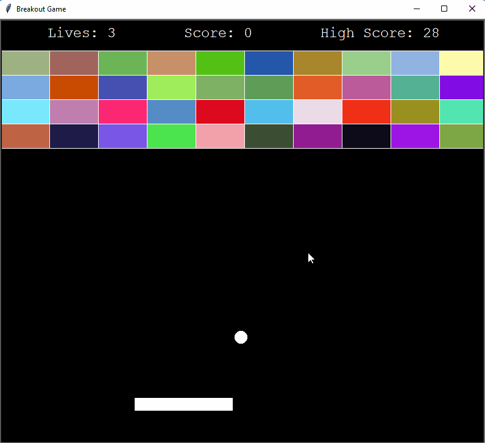

# Python Breakout
80's Breakout Game developed using the python turtle module. 
Program was developed as an assignment for <a href="https://www.udemy.com/course/100-days-of-code/">100 days of code on Udemey.</a>

</img>

## main.py:
* Creates the game objects, game window and runs the game loop. 
* The game run continuously until you exit the window. 

## Paddle:
* An extention of the Turtle class for creating and controlling the paddles position.

## Ball:

* An extention of the Turtle class for creating and controlling the ball. Detects collisions with the paddles and walls, reversing the trajectory.

## Block:
* An extention of the Turtle class for the game breakout blocks. 
* Essentially just instantiates a turtle rectangle object to a positions on the screen with a random colour and assigned points value.

## BlockManager:
* Block orchestration tool class.
* Responsible for insanatating the Blocks with their position and value. 
* Detects collisions with the ball, inactivates blocks and awards points. 
* Resets blocks to active on game over. 

## ScoreBoard:
* An extention of the Turtle class for screen writing scores. 
* Loads and exports high score
